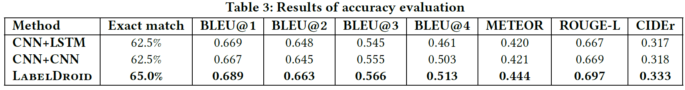

# Unblind Your Apps: Predicting Natural-Language Labels for Mobile GUI Components by Deep Learning

## Introduction

## Dataset
<b>Statistics of our dataset:</b>

*Dataset can be download at <https://drive.google.com/open?id=18BV1oDsvEVY1xvefLe0QpGBPgpvNGY43>*

## Data Preprocessing

The list of meaningless labels can be seen at [Data_preprocessing/missing_label.txt](./Data_preprocessing/meaningless_label.txt)

## Evaluation
We evaluate our model in three aspects, i.e., accuracy with
automated testing, generality and usefulness with user study. We
also shows the practical value of LabelDroid by submitting the
labels to app development teams.

### Accuracy

### Generalization & Usefulness

[Generalization&Usefulness](https://github.com/icse2020Accessibility/icse2020Accessibility/blob/master/Generalization$Usefulness) contains all data we used in this part and the results from model(M), developers(A1,A2,A3) and Evaluator.
